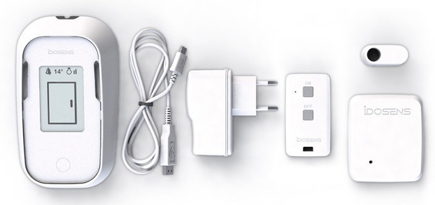

# Idosens endpoints :: RIOT boards and applications

Idosens is a retired product donated to FabMSTIC for research and teaching purposes. The product contains three LoRa endpoints : Base, Sensor and Remote command.



## Getting started

```bash
cd ~/github/RIOT-OS/RIOT
cd examples/hello-world
EXTERNAL_BOARD_DIRS=~/github/campusiot/idosens/boards make BOARD=idosens_sensor

```
