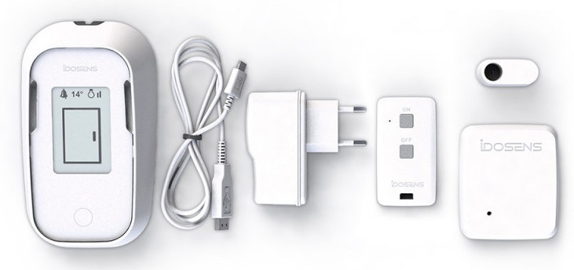

# Idosens endpoints :: RIOT boards and applications

[Idosens](https://www.idosens.com/) is a retired product donated to FabMSTIC for research and teaching purposes. The product contains three LoRa endpoints : Base, Sensor and Remote command.



## Getting started

```bash
cd ~/github/RIOT-OS/RIOT
cd examples/hello-world
EXTERNAL_BOARD_DIRS=~/github/campusiot/idosens/boards make BOARD=idosens_sensor
```

## Requirements
* STLink v2 programmer
* FTDI (USB Serial adapter)
* [Tag-Connect 10-pin no-legs probe](https://www.tag-connect.com/product/tc2050-idc-nl-10-pin-no-legs-cable-with-ribbon-connector).
* Optional : [PCB for connecting the Tag-Connect probe to the STLink v2 programmer and the USB Serial adapter](./tagconnect_adapter)
